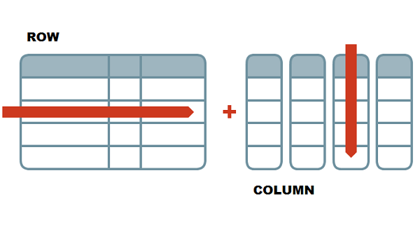

```{r setup, include=FALSE}
knitr::opts_chunk$set(echo = TRUE)
```

# Introduction to Coding

## Learning Outcomes

-   Students will be able to define the following terms:
    -   object
    -   assignment
    -   vector
    -   function
    -   data frame
-   Students will be able to run code line-by-line and as code chunks from an Rmarkdown file.
-   Students will be able to comment their code effectively.
-   Students will be able to write code assign values to variables and use these variables to perform various operations.
-   Students will be able to use help files to learn how to use functions.
-   Students will be able to recall and explain how functions operate, and the basic syntax around functions (arguments, auto-completion, parentheses).
-   Students will be able to differentiate different data classes in R.
-   Students will learn how to create their own data structures (vectors, data frames).

## Assigning Objects

Assignments are really key to almost everything we do in R. This is how we create permanence in R. Anything can be saved to an object, and we do this with the assignment operator, `<-`.

The short-cut for `<-` is `Alt + -` (or `Option + -` on a Mac)

```{r}


```

## 1-Dimensional Data: Vectors

We can also assign more complex group of elements of the same type to a particular object. This is called a **vector**, a basic data structure in R.

```{r}


```

## Data classes

There are a few main types in R, and they behave differently.

-   Numeric: numbers
    -   Integer (no decimals allowed)
    -   Double (decimals allowed --- interchangeable with numeric)
-   Character: letters or mixture
-   Logical: True or False; T or F
-   Factors: best used for data that need to be in a specific order; levels indicate the order

```{r}


```

Vectors have to contain elements that are all of the same class.

```{r, eval = FALSE}


```

### Sub-setting Vectors

Sometimes we want to pull out and work with specific values from a vector. This is called sub-setting (taking a smaller set of the original). To signify which element of the vector we'd like to pull out, we can use a square bracket and the number of the element we are interested in taking.

```{r}


```

## Functions

**Functions** are pre-written bits of codes that perform specific tasks for us. There are ones built into R (base R), but later in the course we will see that there are more specialized ones that we can equipt using another function called `library()`.

Functions are always followed by parentheses. Anything you type into the parentheses are called **arguments**.

```{r}


```

To get more information about a function, use the `help()` function or `? name_of_function`.

```{r}


```

We can use a function called `class()` to figure out the data type of a vector.

```{r}


```

### Group Challenge

Let's practice! Write a few lines of code that do the following:

-   Create a vector with numbers from 6 to 1 (6, 5, 4, 3, 2, 1)
-   Assign the vector to an object named `vec`
-   Subset `vec` to include the last 3 numbers (should include 3, 2, 1)
-   Find the sum of the numbers (hint: use the `sum()` function)

Answer: 6

```{r}


```

Already finished? See if you can condense your code down any further or turn around and help out a neighbor.

```{r}


```

## 2-Dimensional Data: Data Frames

Most of the data you will encounter is two-dimensional, i.e., it has columns and rows. Its structure resembles a spreadsheet. R is really good with these types of data.

-   **Rows** go side-to-side
-   **Columns** go up-and-down



Data frames are made up of multiple vectors. Each vector becomes a column.

```{r}


```

### Sub-setting Data Frames

Because data frames are two-dimensional, we can subset data in different ways. We can select specific columns, specific rows, or filter rows by values.

R always takes information for the row first, then the column.

```{r}


```

Another way to pull out a single column from a data frame is with the `$` operator. This can really come in handy when you know the name of the column but not the position.

```{r}


```

Ideally, after typing `$`, R should give you a drop down list of all the column names that you can select from. Sometimes that doesn't happen though, and that's okay! You can also find column names / numbers by opening and looking through your data frame object in the Environment.

### Discussion Point

This is a simple data set, but let's come up with some questions.

Example: Height of plants treated with nitrogen vs. those not treated.

```{r}


```

### Group Challenge (5 min)

Using help files on functions

As a group, find the standard deviation (`sd()`) of the height of plants treated with nitrogen and those not treated with nitrogen. Which group has the larger standard deviation?

```{r}


```

Come up with a definition of standard deviation (Google is your friend!), use the help file (`help()` or `? function`) to find out how the `sd()` function works, and be prepared to show the code you used.

## Helpful Functions

Below are some functions that I often find very helpful when working with vectors and data frames:

-   `str()`
-   `head()` and `tail()`
-   `length()`
-   `ncol()` and `nrow()`
-   `names()`

```{r}


```
